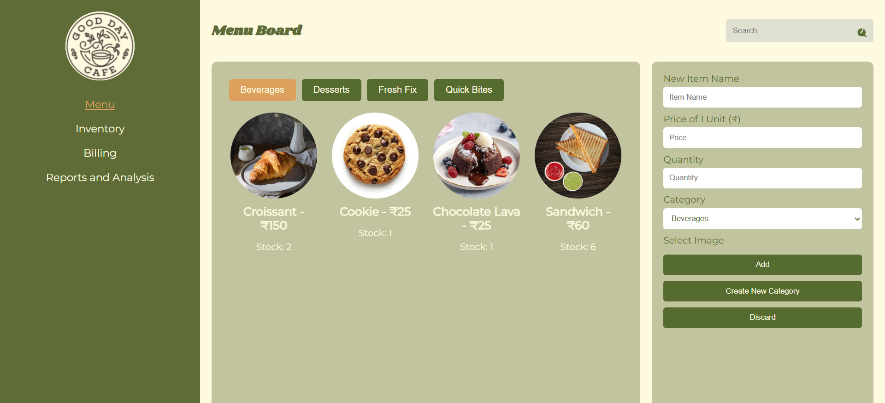
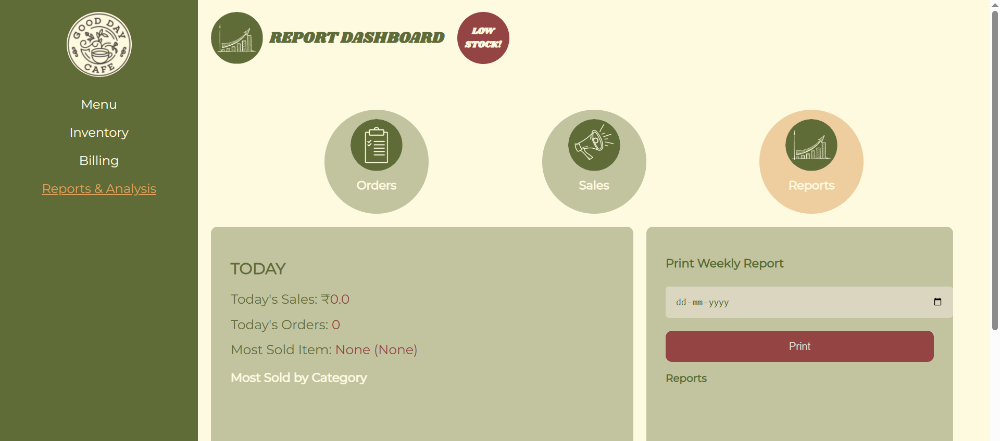
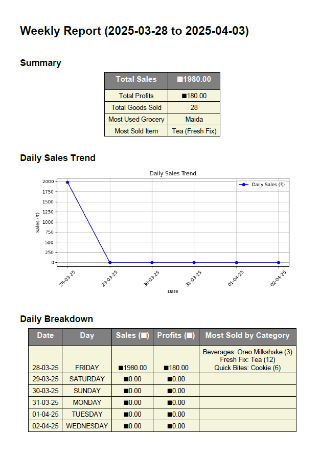

# 🍽️ Offline Restaurant Management System

An **Offline Restaurant Management System** built using **Python, HTML, CSS, JavaScript, and MySQL**, designed for small restaurants to manage daily operations such as **menu management, billing, inventory tracking, and sales reporting** — all without the need for an internet connection.

---

## 🚀 Features

### 🧾 Billing Module
- Generate and print customer bills.
- Automatically calculates taxes and total amounts.
- Saves billing history in the database.

### 🍴 Menu Module
- Add, update, or remove menu items.
- Automatically updates availability based on inventory.

### 📦 Inventory Module
- Tracks stock levels of ingredients.
- Alerts for low-stock items.
- Updates automatically when items are sold.

### 📊 Reporting Module
- Generates daily and monthly sales reports.
- Displays top-selling items.
- Exports data for business insights.

---
## 🖼️ Project Overview (Screenshots)

Below are some screenshots showcasing the system’s key interfaces and functionalities:

### 🧾 Billing (Order Page)
.png)

### 💳 Billing (Payment Page)
.png)

### 📦 Inventory Management


### 🍴 Menu Board


### 📊 Reports Dashboard (Orders History)
.png)

### 📈 Reports Dashboard (Sales)
.png)

### 📋 Reports Dashboard (Overview)


### 🖨️ Sample Output of Printed Report


---

## 🛠️ Tech Stack

- **Frontend:** HTML, CSS, JavaScript  
- **Backend:** Python (Flask Framework)  
- **Database:** MySQL  
- **Tools:** Visual Studio Code, MySQL Workbench  

---

## ⚙️ Setup Instructions

### 1️⃣ Clone the Repository

```bash
git clone https://github.com/manut03/OfflineRestaurantManagementSystem.git
cd OfflineRestaurantManagementSystem
```

---

### 2️⃣ Set Up a Virtual Environment

```bash
python -m venv venv
source venv/Scripts/activate   # Windows
pip install -r requirements.txt
```

---

### 3️⃣ Restore the Database

1. Open **MySQL Workbench** or the command line.  
2. Create the database:

   ```sql
   CREATE DATABASE restaurant_db;
   ```

3. Import the SQL dump:

   ```bash
   mysql -u root -p restaurant_db < database/restaurant.sql
   ```

---

### 4️⃣ Run the Application

```bash
python app.py
```

Now open your browser and go to:  
👉 [http://localhost:5000](http://localhost:5000)

---
## 🎥 YouTube Demo

Watch the project demo on YouTube:
🔗 https://youtu.be/AOq1N8khpms

(The video showcases how the project works in real-time.)
---
## 🌱 Future Applications of the Project

As technology evolves, the Offline Restaurant Management System (ORMS) can be expanded with additional functionalities to enhance its efficiency and usability. Below are some potential future improvements:

Multi-User Support:
Implementing a login system with role-based access control would allow different user types (e.g., cashiers, managers, and administrators) to have specific permissions within the system.

Mobile Application:
Developing a companion mobile app for restaurant staff would enable order processing, inventory management, and reporting on-the-go.

Advanced Analytics:
Integrating machine learning algorithms could help with sales forecasting, inventory optimization, and customer preference analysis, providing more data-driven insights.

Cloud Integration:
Hosting the system on cloud platforms such as AWS or Google Cloud would improve scalability, data security, and remote access for business owners.

## 👨‍💻 Author
---
**Manasa**  
🌐 [GitHub Profile](https://github.com/manut03)
